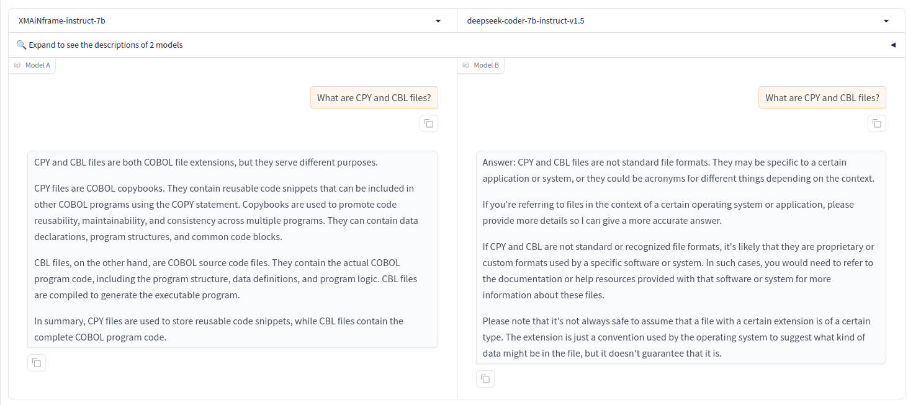
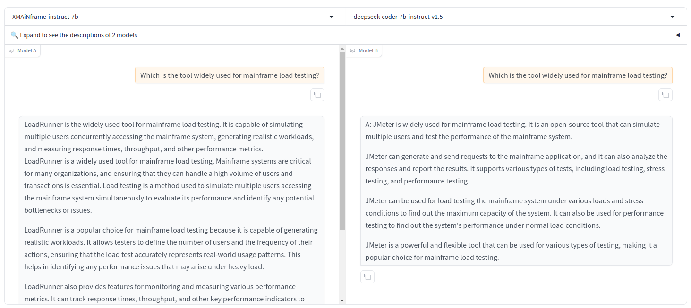
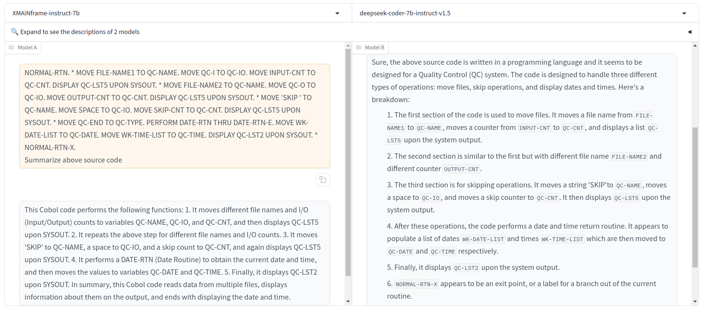
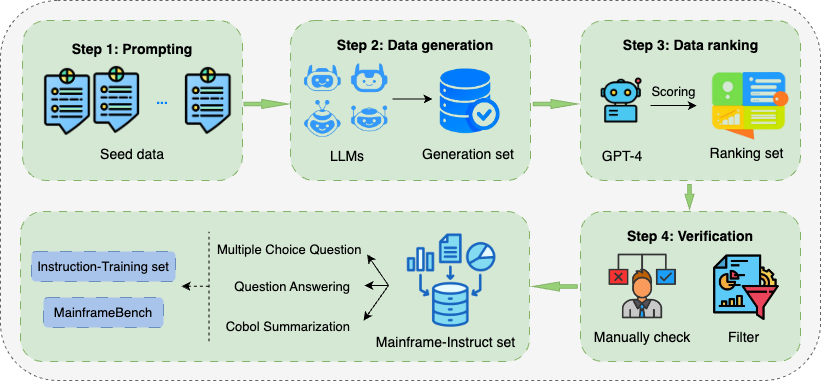

<div align="center">

# COCO LLM: A Large Language Model for Mainframe Modernization
[](https://opensource.org/licenses/MIT)&nbsp;
[](link)&nbsp;
[](https://huggingface.co/collections/Fsoft-AIC/xmainframe-66aca02d5b552e62033dc2bc)&nbsp;&nbsp;
[](https://www.python.org/downloads/release/python-3100/)

</div>


## Table of Contents
- [Introduction](#dataset-summary)
- [Demonstration](#demo)
- [Procedure of Data Construction](#procedure-of-data-construction)
&nbsp; - [Mainframe-Training](#mainframe-training)
&nbsp; - [Mainframe-Instruct](#mainframe-instruct)
- [Model Download](#model-download)
- [Evaluation Results](#evaluation-results)
- [Usage](#usage)
&nbsp; - [Fine-tune COCO LLM](#how-to-fine-tune-xmainframe)
&nbsp; - [Inference](#inference)
- [License](##licensing-information)
- [Acknowledgements](#acknowledgements)
- [Contact Us](#contact-us)
- [Citation Information](#citation-information)


# Introduction

We are introducing **COCO LLM**, a state-of-the-art large language model (LLM) specifically designed with knowledge of mainframe legacy systems and COBOL codebases. COCO LLM is built on top of DeepSeek-Coder 7B and is available with 7B and 10.5B parameters.
Additionally, we present [MainframeBench](https://huggingface.co/datasets/Fsoft-AIC/MainframeBench), a comprehensive benchmark for assessing mainframe knowledge, including multiple-choice questions, question answering, and COBOL code summarization. Our empirical evaluations demonstrate that COCO LLM consistently outperforms existing state-of-the-art LLMs across these tasks. Specifically, COCO LLM achieves 30% higher accuracy than DeepSeek-Coder on multiple-choice questions, doubles the BLEU score of Mixtral-Instruct 8x7B on question answering, and scores six times higher than GPT-3.5 on COBOL summarization. Our work highlights the potential of COCO LLM to drive significant advancements in managing and modernizing legacy systems, thereby enhancing productivity and saving time for software developers.

# Demonstration

In this section, we demonstrate the capabilities of COCO LLM by comparing it with the leading language model, DeepSeek-Coder-7B. We evaluate the performance of each model by showcasing their responses to a series of realistic questions related to mainframe knowledge. The images below illustrate how each model handles identical prompts. As shown, the responses generated by COCO LLM are not only accurate but also more detailed and comprehensive compared to those from the base model, DeepSeek-Coder-7B. This makes COCO LLM particularly valuable for developers seeking a reliable and thorough AI assistant in the mainframe environment.

<div align="center">






</div>


# Procedure of Data Construction
## Mainframe-Training

We utilized two different sources: using the GitHub API to collect COBOL projects hosted on GitHub and gathering online document data relevant to mainframes. In total, Mainframe-Training Dataset consists of 236 million tokens from documents about the mainframe technology and COBOL constructs. In the pre-training process, we combined our Mainframe-Training Dataset with [SlimOrca-Dedup](https://huggingface.co/datasets/Open-Orca/SlimOrca-Dedup) to enrich the model’s mainframe knowledge while retaining its general capabilities.

## Mainframe-Instruct

<div align="center">



</div>

Mainframe-Instruct is a high-quality synthetic dataset created through 5 steps:

- Step 1: 300 seed data instances about Mainframe and COBOL are gathered and annotated by our domain experts.

- Step 2: Using popular LLMs to enrich Mainframe-Instruct from seed data.

- Step 3: Utilizing GPT-4 as an evaluator to judge model responses, scoring the outputs and ranking responses in a pairwise manner.

- Step 4: Filtering and manually checking.

- Step 5: Dividing Mainframe-Instruct into three tasks: Multiple Choice Questions, Question Answering, and COBOL summarization.

Below are the statistics of Mainframe-Instruct Dataset:

<table>
&nbsp; &nbsp; <tr>
&nbsp; &nbsp; &nbsp; &nbsp; <td> </td>
&nbsp; &nbsp; &nbsp; &nbsp; <td>Training Samples</td>
&nbsp; &nbsp; &nbsp; &nbsp; <td>Validating Samples</td>
&nbsp; &nbsp; &nbsp; &nbsp; <td>Testing Samples</td>
&nbsp; &nbsp; </tr>
&nbsp; &nbsp; <tr>
&nbsp; &nbsp; &nbsp; &nbsp; <td>Multiple Choice Questions</td>
&nbsp; &nbsp; &nbsp; &nbsp; <td>13.894</td>
&nbsp; &nbsp; &nbsp; &nbsp; <td>1.544</td>
&nbsp; &nbsp; &nbsp; &nbsp; <td>1.931</td>
&nbsp; &nbsp; </tr>
&nbsp; &nbsp; <tr>
&nbsp; &nbsp; &nbsp; &nbsp; <td>Question Answering</td>
&nbsp; &nbsp; &nbsp; &nbsp; <td>18.692</td>
&nbsp; &nbsp; &nbsp; &nbsp; <td>2.078</td>
&nbsp; &nbsp; &nbsp; &nbsp; <td>2.598</td>
&nbsp; &nbsp; </tr>
&nbsp; &nbsp; <tr>
&nbsp; &nbsp; &nbsp; &nbsp; <td>COBOL Summarization</td>
&nbsp; &nbsp; &nbsp; &nbsp; <td>9.081</td>
&nbsp; &nbsp; &nbsp; &nbsp; <td>1.010</td>
&nbsp; &nbsp; &nbsp; &nbsp; <td>2.523</td>
&nbsp; &nbsp; </tr>
</table>


[MainframeBench](https://huggingface.co/datasets/Fsoft-AIC/MainframeBench), our benchmark for mainframe knowledge, is the testing set in Mainframe-Instruct Dataset. This benchmark is used to evaluate our LLMs with others which is now available at Huggingface datasets.

```python
from datasets import load_dataset

# Load each sub-set in MainframeBench
QA_set = load_dataset("Fsoft-AIC/MainframeBench", 'question_answering')
MC_set = load_dataset("Fsoft-AIC/MainframeBench", 'multiple_choice_question')
Summarization_set = load_dataset("Fsoft-AIC/MainframeBench", 'COBOL_code_summarization')
